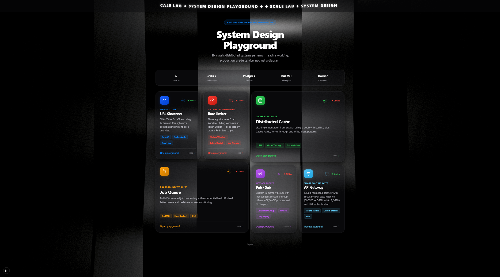

# ⚗️ ScaleLab — System Design Playground

> Production-quality implementations of classic distributed system patterns. Not theory — working code.

[](https://nodejs.org)
[](https://fastify.dev)
[](https://redis.io)
[](https://postgresql.org)
[](https://docker.com)
[](LICENSE)

---




---


## What is this?

ScaleLab is a portfolio repository that demonstrates senior-level system design thinking through **working code** — not slides, not diagrams, not blog posts.

Each module is a self-contained mini-service implementing a classic distributed systems pattern, built with a real production stack.

**What you'll find here:**

- Systems thinking beyond feature coding
- Distributed architecture with real trade-off analysis
- Production engineering practices (retry, backoff, circuit breaker, DLQ)
- A full working stack: Redis, PostgreSQL, BullMQ, Docker

---

## Architecture Overview

```
                        ┌──────────────────────┐
                        │   Dashboard (Next.js) │
                        │       :3000           │
                        └──────────┬───────────┘
                                   │
       ┌───────────────────────────┼────────────────────────────┐
       │                           │                            │
  ┌────▼────┐  ┌────────┐  ┌──────▼──────┐  ┌──────┐  ┌──────▼──────┐
  │  URL    │  │  Rate  │  │ Distributed │  │ Job  │  │   Pub/Sub   │
  │Shortener│  │Limiter │  │    Cache    │  │Queue │  │   System    │
  │  :3001  │  │  :3002 │  │    :3003    │  │:3004 │  │    :3005    │
  └────┬────┘  └───┬────┘  └──────┬──────┘  └──┬───┘  └──────┬─────┘
       │           │              │             │             │
  ┌────▼───────────▼──────────────▼─────────────▼─────────────▼──────┐
  │                         Redis :6379                               │
  └───────────────────────────────┬───────────────────────────────────┘
                                  │
  ┌───────────────────────────────▼───────────────────────────────────┐
  │                       PostgreSQL :5432                            │
  └───────────────────────────────────────────────────────────────────┘
```

---

## Modules

| Module | Port | Key Concepts | Tech |
|--------|------|--------------|------|
| [URL Shortener](./services/url-shortener) | 3001 | Base62, Cache-Aside, Read-Heavy | Redis, PostgreSQL |
| [Rate Limiter](./services/rate-limiter) | 3002 | Sliding Window, Token Bucket, Atomic Lua | Redis |
| [Distributed Cache](./services/distributed-cache) | 3003 | LRU, Write-Through, Cache-Aside | Redis, PostgreSQL |
| [Job Queue](./services/job-queue) | 3004 | Exponential Backoff, DLQ, Idempotency | BullMQ, Redis |
| [Pub/Sub System](./services/pub-sub) | 3005 | Consumer Groups, Offsets, DLQ Replay | In-memory |
| [API Gateway](./services/api-gateway) | 3006 | Round Robin, Circuit Breaker, JWT | Fastify, JWT |
| Dashboard | 3000 | Real-time monitoring UI | Next.js 14 |

---

## Quick Start

### Prerequisites

- Docker & Docker Compose
- Node.js 20+

### One command (Docker)

```bash
docker-compose up --build
```

Open [http://localhost:3000](http://localhost:3000) — dashboard comes up with all services running.

### Local development (without Docker)

Start Redis and PostgreSQL:

```bash
docker run -d -p 6379:6379 redis:7-alpine
docker run -d -p 5432:5432 -e POSTGRES_PASSWORD=password -e POSTGRES_DB=scalelab postgres:16-alpine
```

Then run each service in a separate terminal:

```bash
cd services/url-shortener   && npm install && npm run dev  # :3001
cd services/rate-limiter     && npm install && npm run dev  # :3002
cd services/distributed-cache && npm install && npm run dev # :3003
cd services/job-queue        && npm install && npm run dev  # :3004
cd services/pub-sub          && npm install && npm run dev  # :3005
cd services/api-gateway      && npm install && npm run dev  # :3006
cd dashboard                 && npm install && npm run dev  # :3000
```

---

## Module Deep-Dives

<details>
<summary><strong>Module 1 — URL Shortener</strong> · Base62 · Cache-Aside · Collision handling</summary>

### Request Flow

```
POST /shorten → SHA-256(url+attempt) → Base62 encode → 7-char code
              → Check DB for collision → retry(attempt+1) if taken
              → INSERT PostgreSQL
              → Populate Redis cache (TTL: 1h)

GET /r/:code  → Redis lookup
              → HIT:  redirect 302
              → MISS: PostgreSQL lookup → re-populate cache → redirect 302
              → Track click via Redis HINCRBY
```

### Design Decisions

| Decision | Chosen | Alternative | Reason |
|----------|--------|-------------|--------|
| Hash | SHA-256 → Base62 | MD5, UUID | Deterministic, no coordination needed |
| Database | PostgreSQL | DynamoDB | Strong consistency for URL lookup |
| Cache | Cache-Aside | Write-Through | Lazy population, low write overhead |
| Collision | Retry with salt | Counter suffix | Produces cleaner short codes |

### Scaling to 10M+ users

- **DB sharding:** Hash `short_code` via consistent hashing across shards
- **CDN:** Edge-cache popular redirects — 99% of traffic is read-only
- **Read replicas:** 80% reads → PostgreSQL streaming replicas
- **Redis Cluster:** Consistent hash ring across Redis nodes

</details>

<details>
<summary><strong>Module 2 — Rate Limiter</strong> · Sliding Window · Token Bucket · Atomic Lua</summary>

### Sliding Window Counter

```
Time: ──────────[── window ──────────]──►
                 ZREMRANGEBYSCORE (remove expired)
                 ZCARD → count < limit?
                 ZADD(now, requestId)
```

**Pros:** Most accurate, no boundary spike  
**Cons:** O(n) memory per user (n = requests in window)

### Token Bucket

```
Capacity:    10 tokens
Refill rate: 1 token / second
Per request: consume 1 token (reject if empty)
```

**Pros:** Handles burst traffic up to capacity  
**Cons:** Harder to reason about exact per-second limits

### Fixed Window Counter

```
Window:  [00:00 ─── 01:00] [01:00 ─── 02:00]
Counter:  INCR(key:window) → PEXPIRE(windowMs)
```

**Pros:** O(1) memory, simplest implementation  
**Cons:** Boundary spike — up to 2× the limit possible at window edges

### Why Lua scripts in Redis?

Lua scripts execute atomically inside Redis — zero race conditions even with multiple servers hitting the same key simultaneously.

</details>

<details>
<summary><strong>Module 3 — Distributed Cache</strong> · LRU from scratch · Write strategies</summary>

### LRU Implementation

Built from scratch using a HashMap + Doubly Linked List for O(1) get and put:

```
Map<key, Node>   Head ←→ ... ←→ Tail
Hit:      move node to head (MRU position)
Miss:     return -1, populate from DB
Eviction: remove tail node (LRU position)
```

### Cache Strategy Comparison

| Strategy | Read | Write | Consistency | Best For |
|----------|------|-------|-------------|----------|
| Cache-Aside | Cache first, DB on miss | Invalidate cache | Eventual | Read-heavy workloads |
| Write-Through | Cache first | Cache + DB synchronously | Strong | Mixed read/write |
| Write-Back | Cache | Cache only, async DB flush | Weak | Write-heavy workloads |

</details>

<details>
<summary><strong>Module 4 — Job Queue</strong> · Exponential Backoff · DLQ · Idempotency</summary>

### Retry Strategy

```
Attempt 1: immediate
Attempt 2: 1,000ms
Attempt 3: 2,000ms
Attempt 4: 4,000ms
         ↓
       Dead Letter Queue (DLQ)
```

### Key Concepts

- **Idempotency:** Same job ID always produces the same result — safe to retry
- **Dead Letter Queue:** Jobs that exhaust retries land in DLQ for inspection and manual replay
- **Worker concurrency:** Email workers run 3 parallel, image workers run 2
- **Graceful shutdown:** Workers complete in-flight jobs before exiting on SIGTERM

</details>

<details>
<summary><strong>Module 5 — Pub/Sub System</strong> · Consumer Groups · Offset Tracking · DLQ Replay</summary>

### Consumer Group Model

```
Topic: "user-events"
Messages: [m1, m2, m3, m4, m5]

Group A (analytics): offset=3 → reads m4, m5
Group B (email):     offset=1 → reads m2, m3, m4, m5
Group C (audit):     offset=5 → no new messages
```

Each consumer group tracks its own offset independently — the same message can be consumed by multiple groups without interference.

### Dead Letter Queue Flow

```
Publish → Consumer → NACK (failure)
                   → attempts++
                   → attempts >= 3 → DLQ
                                   → POST /dlq/replay → re-enqueued to topic
```

</details>

<details>
<summary><strong>Module 6 — API Gateway</strong> · Circuit Breaker · Round Robin · JWT</summary>

### Circuit Breaker State Machine

```
          failures >= threshold
CLOSED ──────────────────────► OPEN
  ▲                              │
  │  successes >= threshold      │ timeout (30s)
  │                              ▼
  └───────────────────────── HALF_OPEN
                             (test one request)
```

### Round Robin Load Balancer

```
Request 1 → Backend A
Request 2 → Backend B
Request 3 → Backend C
Request 4 → Backend A  ← cycle restarts
            ↑ unhealthy backends are automatically skipped
```

</details>

---

## Load Testing

```bash
# Install k6 (macOS)
brew install k6

# Run URL Shortener stress test
k6 run --env BASE_URL=http://localhost:3001 services/url-shortener/load-tests/k6-script.js
```

---

## System Design Interview Reference

Each module maps directly to a common interview question:

| Interview Question | Module | Demonstrated Concept |
|--------------------|--------|----------------------|
| "Design TinyURL" | URL Shortener | Base62, Cache-Aside, DB indexing |
| "Design a rate limiter" | Rate Limiter | Sliding window, atomic operations |
| "How do you handle cache invalidation?" | Distributed Cache | LRU, write-through, write-back |
| "Design a background job system" | Job Queue | Retry, DLQ, idempotency |
| "Design an event-driven system" | Pub/Sub | Consumer groups, offset tracking |
| "How do you achieve high availability?" | API Gateway | Circuit breaker, load balancing |

---

## Tech Stack

| Layer | Technology |
|-------|------------|
| Backend | Node.js 20 + Fastify 4 |
| Frontend | Next.js 14 (App Router) |
| Cache | Redis 7 |
| Database | PostgreSQL 16 |
| Job Queue | BullMQ 5 |
| Containerization | Docker + Docker Compose |
| Load Testing | k6 |

---

*Built as a system design portfolio — demonstrating distributed systems thinking through working, production-grade code.*
